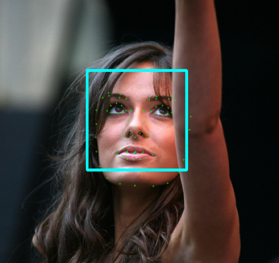
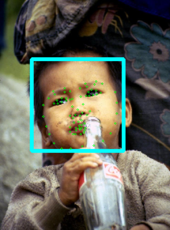
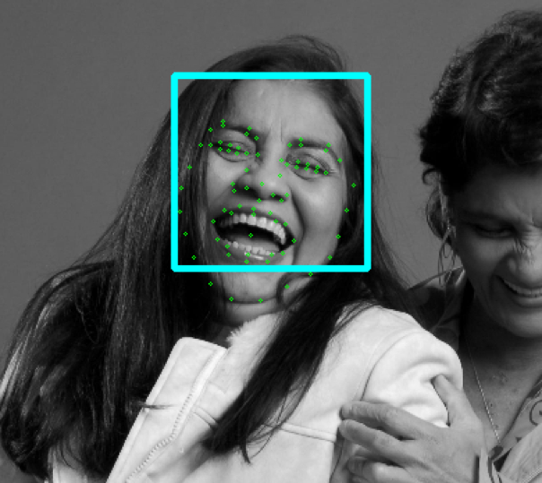
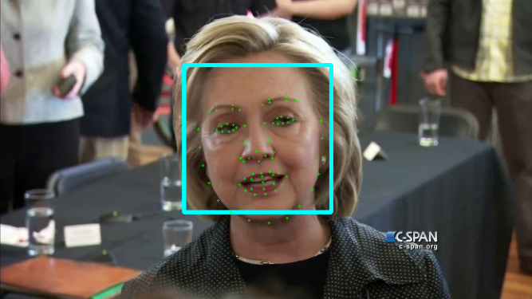
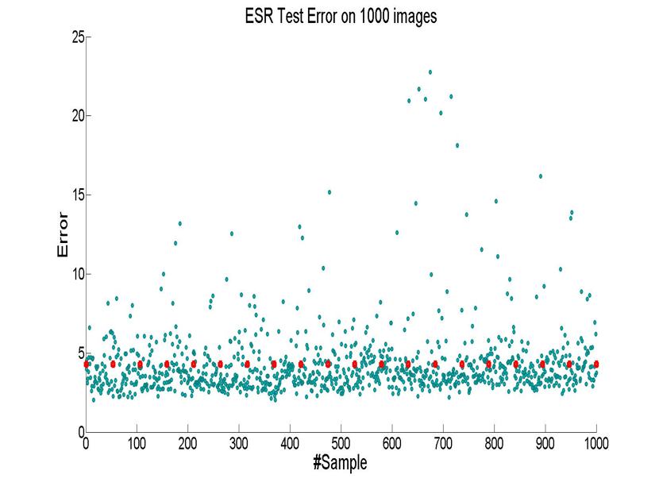
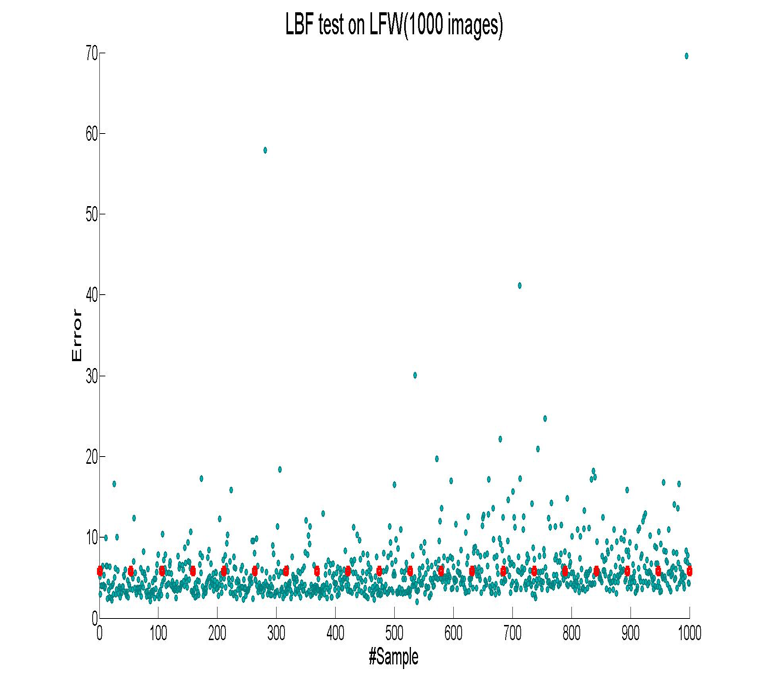
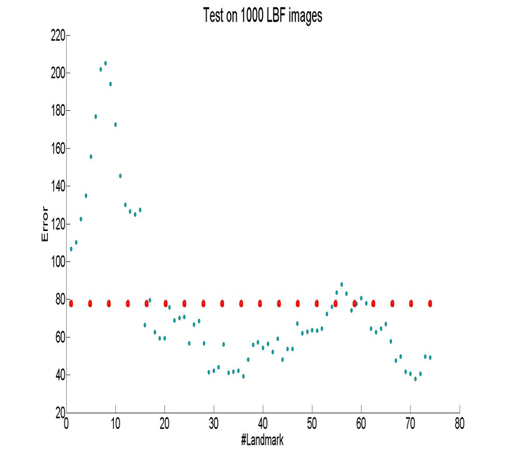

# Face_Alignment
This repository is part of my recent project, including implementation of two face alighment paper:

1.Cao X, Wei Y, Wen F, et al. Face alignment by explicit shape regression[J]. International Journal of Computer Vision, 2014, 107(2): 177-190.

2.Ren S, Cao X, Wei Y, et al. Face alignment at 3000 fps via regressing local binary features[C]//Computer Vision and Pattern Recognition (CVPR), 2014 IEEE Conference on. IEEE, 2014: 1685-1692.

##Introduction
###Explicit Shape Regression(ESR)
* Cascade regressor(boosting)
* Random Fern

###Local Binary Features(LBF)
* Cascade feature extractor
* Random forest(Bootstrap)
* Global regression

##Implementation
1. ESR is easy to be vectorized. Quick matlab implementation in the above folder. The training/testing data should be cropped into same size
2. LBF is implemented in C++ with a prototype in matlab. Random Forest training and testng are parealleled by Openmp. Overall landmark detection speed is 300fps(740 trees in each stage, tree depth is 5). 

##Result
###Face alignment on images
</img>
</img>
</img>
###Real time face alignment on video
</img>
</img>

##Evaluation
The average point-to-point Euclidean error normalized by the inter-ocular distance (measured as the Euclidean distance between the outer corners of the eyes) will be used as the error measure. Each method is trained on a subset of LFW dataset(one thousand images with 74 landmarks) The face detection in ESR is pre-computed using Faceplusplus public API, so ESR seems to have a better performance. Opencv's Haarcascade face detector used in LBF has a high false-positive detection rate.
###Explicit Shape Regression(ESR)
</img>
</img>
###Local Binary Features(LBF)
</img>
</img>

Both regression methods yield good accuracy on most images, however, they suffer large error on face contour(See #landmark1-15 in the right figures)

